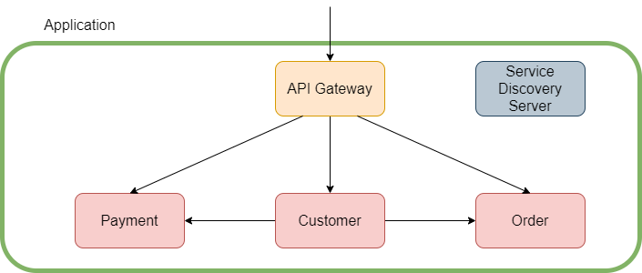
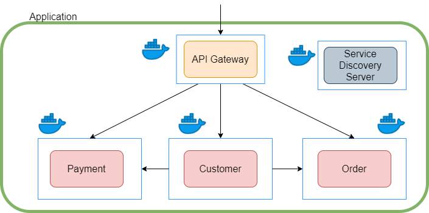

# Microservices with Spring Boot, Docker and Kubernetes

[here](https://lauweitang.medium.com/microservices-with-spring-boot-docker-and-kubernetes-part-1-3f50bfca582e)

## Microservice over Monolithic

### Monolithic Architecture

Prior to Microservice architecture, most companies adopted the Monolithic architecture. Monolithic architecture provides
a centralised code base which is easy to develop and test. Furthermore, it provides ease in deployment as we are dealing
with only one executable file, e.g. single jar file for Spring Boot application. However, its weakness starts to emerge
as codebase grows and during scaling of the application. Monolithic applications tend to be large, which causes long
deployment time and scaling of multiple instances of the application. The analogy that I like to use to describe
Monolithic applications is having one superhero to save the world.

### Microservice architecture

Microservice architecture provides highly extensible code base and clear segregation of the business logics. In
Microservice architecture, the application is made up of multiple microservices. You can view each of these
microservices as a component of your business logic. These components are identified by dividing the business logics
using bounded context. These bounded contexts can be developed and viewed as a microservice. For instance, an e-commerce
application can be divided into multiple microservices. These microservices include Payment, Order, Customer and more.
Moreover, due to the recent popularity among companies in having smaller teams, each of these microservices can be
developed by a small team. In terms of deployment and scaling, each of the microservices can be individually deployed
and scaled based on business needs. However, because the microservices are individually deployed, there is a need to
have a mechanism that allow each microservices to discovery the presence of other microservices. Thus, in this guide, we
will develop a simple e-commerce Spring Boot application adopting the Microservice architecture.

## Microservices using Spring Boot

The architectural of our simple e-commerce application is shown below. In our overly simplified example, we only have
one customer, and all the payments and orders are made by him. There are three main components, namely API Gateway,
Service Discovery Server, and Microservices.

### API Gateway

API Gateway provides a single point-of-entry to the application. It redirects the request received to the appropriate
microservices. This redirection is transparent to the user. Thus, allowing the user to use the application via the same
host / url.

### Service Discovery Server

Service Discovery Server applies the service discovery mechanism to allow microservices to communicate with each other.
Each microservices will register with the Service Discovery Server such that it can be discovered by other
microservices.

### Microservice

Microservice is a component of the application. It usually contains the implementation details and logic of the
application. It will register with the Service Discovery Server such that other microservices can call its APIs.
Strictly speaking, the API Gateway and Service Discovery Server are microservice.

## Why Docker and Kubernetes for Microservices?

Manual management and scaling of microservices is tedious and manual application start up can be time-consuming (even in
our small example).

Furthermore, we were unable to start up multiple instances of the same microservices due to port conflict, unless we
modified the port before starting up.

Docker and Kubernetes handle the hassle for us.

- Docker is a technology that containerise applications such that these containers can be deployed regardless of
  platform (Windows, Mac or Linux) without installing the relevant dependencies.
- Kubernetes is a tool that allows developers to manage and scale these containers easily.

## Dockerfile :

<ul>
	<li><b>FROM</b> — The base image of the build process. The image will be built onto of this base image</li>
	<li><b>EXPOSE</b> — Exposing the container via this port</li>
	<li><b>ARG</b> — The argument of the file. You can think of it as variable of the Dockerfile</li>
	<li><b>COPY</b> — Copy the variable into the directory ./app.jar in the container</li>
	<li><b>CMD</b> — The command to be run</li>
</ul>
