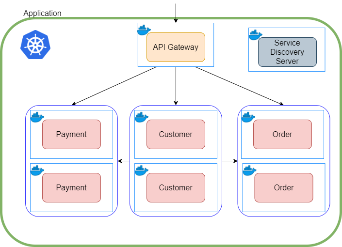

# Microservices with Spring Boot, Docker and Kubernetes: 

Source [here](https://lauweitang.medium.com/microservices-with-spring-boot-docker-and-kubernetes-part-1-3f50bfca582e)


<details>	
	<summary>
		Notes:
	</summary>
	

### Build the Gradle Wrapper: 
```
gradle wrapper --gradle-version [gradle version]
```
### Kill all the containers: 
```
docker kill $(docker container ls -q)
```
### Docker compose: 
```
docker-compose up
```
### Build the docker image:
```
docker build -t name-of-the-service .
```
### Run the docker image:
```
docker run -d -p [port]:[port] --name="name-of-the-service" name-of-the-container
```
</details>

## Microservice over Monolithic:

### Monolithic Architecture:

Prior to Microservice architecture, most companies adopted the Monolithic architecture. Monolithic architecture provides
a centralised code base which is easy to develop and test. Furthermore, it provides ease in deployment as we are dealing
with only one executable file, e.g. single jar file for Spring Boot application. However, its weakness starts to emerge
as codebase grows and during scaling of the application. Monolithic applications tend to be large, which causes long
deployment time and scaling of multiple instances of the application. The analogy that I like to use to describe
Monolithic applications is having one superhero to save the world.

### Microservice architecture:

Microservice architecture provides highly extensible code base and clear segregation of the business logics. In
Microservice architecture, the application is made up of multiple microservices. You can view each of these
microservices as a component of your business logic. These components are identified by dividing the business logics
using bounded context. These bounded contexts can be developed and viewed as a microservice. For instance, an e-commerce
application can be divided into multiple microservices. These microservices include Payment, Order, Customer and more.
Moreover, due to the recent popularity among companies in having smaller teams, each of these microservices can be
developed by a small team. In terms of deployment and scaling, each of the microservices can be individually deployed
and scaled based on business needs. However, because the microservices are individually deployed, there is a need to
have a mechanism that allow each microservices to discovery the presence of other microservices. Thus, in this guide, we
will develop a simple e-commerce Spring Boot application adopting the Microservice architecture.

## Microservices using Spring Boot:

The architectural of our simple e-commerce application is shown below. In our overly simplified example, we only have
one customer, and all the payments and orders are made by him. There are three main components, namely API Gateway,
Service Discovery Server, and Microservices.


### API Gateway:

API Gateway provides a single point-of-entry to the application. It redirects the request received to the appropriate
microservices. This redirection is transparent to the user. Thus, allowing the user to use the application via the same
host / url.

### Service Discovery Server: 

Service Discovery Server applies the service discovery mechanism to allow microservices to communicate with each other.
Each microservices will register with the Service Discovery Server such that it can be discovered by other
microservices.

### Microservice: 

Microservice is a component of the application. It usually contains the implementation details and logic of the
application. It will register with the Service Discovery Server such that other microservices can call its APIs.
Strictly speaking, the API Gateway and Service Discovery Server are microservice.

## Why Docker and Kubernetes for Microservices?

Manual management and scaling of microservices is tedious and manual application start up can be time-consuming (even in
our small example).

Furthermore, we were unable to start up multiple instances of the same microservices due to port conflict, unless we
modified the port before starting up.

Docker and Kubernetes handle the hassle for us.

- Docker is a technology that containerise applications such that these containers can be deployed regardless of
  platform (Windows, Mac or Linux) without installing the relevant dependencies.
- Kubernetes is a tool that allows developers to manage and scale these containers easily.


## Docker:
### Dockerfile:

<ul>
	<li><b>FROM</b> — The base image of the build process. The image will be built onto of this base image</li>
	<li><b>EXPOSE</b> — Exposing the container via this port</li>
	<li><b>ARG</b> — The argument of the file. You can think of it as variable of the Dockerfile</li>
	<li><b>COPY</b> — Copy the variable into the directory ./app.jar in the container</li>
	<li><b>CMD</b> — The command to be run</li>
</ul>

### Docker-Compose: 
With the docker images built, we are ready to compose the construction of containers. There are two ways to start the containers. The first way is via the command line using the docker run command. However, command line is not ideal if you have multiple containers and with complex instructions. The second way is to use Docker-Compose. Docker-Compose is a file that contains a set of instructions in starting the applications.

In the code below (see docker-compose.yml), you can see that we have multiple services. Each service contains the relevant information of the service. The important part is to contain the links and depends_on fields to indicate the dependencies between microservices.

## Kubernetes: 
Kubernetes is a technology that supports automating deployment, scaling, and management of containerized applications.
From the architectural diagram below, now the whole application lives within the Kubernetes cluster. 

Furthermore, kKubernetes has a component called pod, which is the smallest deployable units in Kubernetes. A pod contains one or more instance of container. As you can see from the diagram, our Payment pod contains two payment microservice instances.


When the application is deployed on Kubernetes, we would like to have the Kubernetes settings and configurations. This can be achieved using Spring Profiles. 
Furthermore, since Kubernetes comes with default service discovery mechanism, we will be disabling Eureka when deployed on Kubernetes.

In api-gateway.yml file, copy the configuration below. In our example, we are using two types of Kubernetes recources, Deployment and Service .
- Deployment: Creates the pod with the relevant metadata and based on the template specified. This is where we can specify the number of containers in the pod.
- Service: Exposes the deployment such that it can be reached by other pods in the cluster.

```
apiVersion: apps/v1
kind: Deployment
metadata:
  name: api-gateway
  labels:
    app: api-gateway
  namespace: default
spec:
  replicas: 1
  selector:
    matchLabels:
      app: api-gateway
  template:
    metadata:
      labels:
        app: api-gateway
    spec:
      containers:
        - name: api-gateway
          image: api-gateway:latest
          imagePullPolicy: IfNotPresent
          ports:
            - containerPort: 8080
---
apiVersion: v1
kind: Service
metadata:
  name: api-gateway
  namespace: default
spec:
  selector:
    app: api-gateway
  ports:
    - protocol: TCP
      port: 8080
      targetPort: 8080
  type: LoadBalancer

```

For the other services that does not need to perform Load Balancing, simply change spec.type under Service into NodePort .

Creating the Kubernetes resources is as simple as entering the command below. Make sure that you cd into the Kubernetes folder.
```kubectl create -f api-gateway.yml -f customer-service.yml -f order-service.yml -f payment-service.yml```

Now you should be able to see the result when you enter http://localhost:8080/api/customer . If you try other ports, you will realise that those ports are not exposed outside of the Kubernetes cluster. This provides a layer of security and a single entry point (API Gateway).

You can view the resources by running ```kubectl get all``` . This will return all the resources that are running in the cluster.

answer:
```
NAME                                    READY   STATUS    RESTARTS   AGE
pod/api-gateway-7f8dc55ccf-c2vzc        1/1     Running   0          2m50s
pod/customer-service-5598dc987f-kzmfp   1/1     Running   0          2m50s
pod/order-service-84dfbdfbd4-mrxmg      1/1     Running   0          2m50s
pod/payment-service-75bb4b785-9kx9b     1/1     Running   0          2m50s

NAME                       TYPE           CLUSTER-IP       EXTERNAL-IP   PORT(S)          AGE
service/api-gateway        LoadBalancer   10.104.123.2     localhost     8080:30893/TCP   2m50s
service/customer-service   NodePort       10.107.76.70     <none>        8083:30286/TCP   2m50s
service/kubernetes         ClusterIP      10.96.0.1        <none>        443/TCP          3m5s
service/order-service      NodePort       10.101.86.98     <none>        8082:32636/TCP   2m50s
service/payment-service    NodePort       10.100.240.204   <none>        8081:30129/TCP   2m50s

NAME                               READY   UP-TO-DATE   AVAILABLE   AGE
deployment.apps/api-gateway        1/1     1            1           2m50s
deployment.apps/customer-service   2/2     2            2           2m50s
deployment.apps/order-service      1/1     1            1           2m50s
deployment.apps/payment-service    1/1     1            1           2m50s

NAME                                          DESIRED   CURRENT   READY   AGE
replicaset.apps/api-gateway-7f8dc55ccf        1         1         1       2m50s
replicaset.apps/customer-service-5598dc987f   2         2         2       2m50s
replicaset.apps/order-service-84dfbdfbd4      1         1         1       2m50s
replicaset.apps/payment-service-75bb4b785     1         1         1       2m50s
```

Scaling is extremely simple. Simply change the value of replicas under Deployment and run kubectl apply -f FILE_NAME . For example, I want to scale customer-service to two instances. I have modified the replicas to 2 and run ```kubectl apply -f customer-service.yml``` . You will see two customer-service pods and in deployment.apps/customer-service.

So ```kubectl get all``` gives : 
```
...
pod/customer-service-5598dc987f-kzmfp   1/1     Running   0          2m50s
pod/customer-service-5598dc987f-q9dr4   1/1     Running   0          13s
...
```
