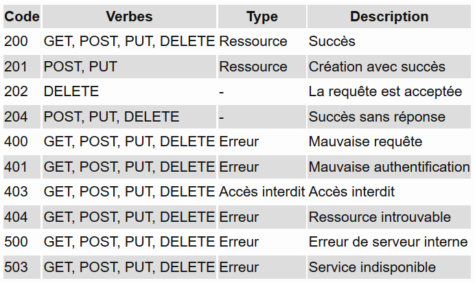

# Api REST : 

## RESTful ?
Pour considérer qu’une API est RESTful, 6 contraintes ont été proposées par Roy Fielding:

1.  **Client-Server** – Un mode de communication avec séparation de rôles entre client et serveur.
2.  **Stateless Server** – Les requêtes doivent contenir toutes les informations nécessaires au traitement. Il ne doit pas y avoir une notion de session côté serveur. Cette contrainte est indispensable pour rendre une API scalable.
3.  **Cache** – La réponse du serveur doit être cacheable côté client.
4.  **Uniform interface** – La méthode de communication entre client et serveur doit être uniforme avec des ressources identifiables, représentables et auto-descriptives. Autrement dit, en vocabulaire HTTP, avec une URL et une réponse contenant un body et une entête.
5.  **Layered System** – Le système doit permettre le rajout de couches intermédiaires _(proxy server, firewall, CDN, etc …)_.
6.  **Code-on-Demand Architecture (optionnelle)** – L’architecture doit permettre d’exécuter du code côté client.

## LES IDENTIFIANTS DE RESSOURCE

**REST** est une architecture orientée ressources où chaque ressource est accessible via un identifiant unique _(URI)_.

## LES CODES RETOUR HTTP D’API REST

## SÉCURITÉ: 
D’une manière générale, une API est censée être sécurisée et protégée contre les requêtes anonymes.
En pratique, trois techniques sont principalement utilisées pour sécuriser une API:

**>** _HTTP Basic Authentication_
**>** Oauth
**>** OpenID

### HTTP Basic Authentication: 

Il s’agit de la solution la plus simple. Consiste à envoyer le login et le mot de passe dans l’entête de chaque requête.

Bien évidemment, il est fortement conseillé d’utiliser le protocole HTTP en mode chiffré _(HTTPS)_ pour ne pas circuler le mot de passe en claire dans les trames réseaux _(faille aux attaques de type MITM)_.

Pour plus de sécurité, surtout si le client de l’API est à l’extérieur de votre réseau, il est préconisé d’utiliser un jeton de sécurité JWT _(Json Web Token)_. Le JWT devrait avoir une durée de vie _(TTL)_ limitée.

### Oauth: 

Oauth est un protocole de délégation d’autorisation nécessitant un serveur tiers comme fournisseur d’accès.

Malgré la complexité de sa mise en place, ce protocole est très apprécié pour sa sécurité.

Il existe deux versions:

_**> Oauth 1.0** – Il s’agit de la version la plus dure à mettre en place car nécessite un partage de clé entre client et serveur pour le calcul d’une signature_ (même principe que SSL)_. Cette version est recommandée pour les APIs sans HTTPS._
**> Oauth 2.0** – Cette version est plus aisée à mettre en place car ne dispose pas de calcul de signature. Par contre, en l’occurrence le HTTPS est exigé. Néanmoins, cette version est moins sécurisée que Oauth 1.0.

### OpenID: 

De base, OpendID est un système d’identification en mode SSO. Il permet à un client de se connecter auprès de plusieurs sites sans devoir créer un compte à chaque fois.

Le mode de fonctionnement ressemble à celui de Oauth. Il faut un fournisseur d’identité _(OpendID providers)_ pour établir un lien de confiance entre le client et le serveur. Souvent, le fournisseur d’identité est un grand nom du Web _(facebook, twitter, google, …)_.

D’autre part, cette solution ne permet pas de gérer l’authentification. De ce fait, il existe une deuxième version _(OpenID Connect)_ qui intègre une sous couche Oauth.

## VERSIONING: 

Les modifications au niveau des ressources sont souvent problématiques car nécessitent des mises à jour côté client qui peuvent s’avérer très compliqués, surtout si ce dernier est en dehors du périmètre _(partenaire ou application mobile)_. De ce fait, il est préconisé de ne pas modifier les services mais plutôt d’en créer de nouveaux.

En général, il y a trois façons de réaliser le versioning:

**> Via l’URL** – Consiste à rajouter le numéro de version dans l’URL de chaque ressource._
**> Via l’entête HTTP** – S’appuie sur des mécanismes d’identification de version depuis l’entête de la requête _(AcceptHeaderVersioning)_.
**> Via les paramètres** – Dans ce type de gestion, la version est passée dans les paramètres de la requête.
**Le versioning via l’URL est la solution la plus adoptée dans les APIs.**

## DOCUMENTATION: 
La documentation est un élément central pour faire en sorte que les personnes puissent exploiter une API. Il est important que cette documentation soit rédigée par les développeurs eux-même.
**> Swagger** : un ensemble d’outils pour aider les développeurs dans la conception, le build, la documentation et la consommation d’API.

## API MANAGEMENT: 

Des solutions d’API Management _(ou API Gateway)_ :

-   [Kong](https://getkong.org/)– Solution open-source basée sur un système de plugins.
-   [Ty](https://tyk.io/) – Solution open-source facilement intégrable et disponible en version dockerisée.
-   [https://gravitee.io/](https://gravitee.io/)  – Solution open-source en Java.
-   [Zuul](https://github.com/Netflix/zuul) – Solution open-source en Java.
-   [API Umbrella](https://apiumbrella.io/)  – Solution open-source en Java.