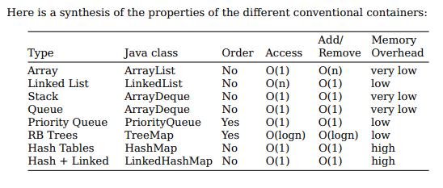

# Java Notes : 

Links: 

  <ul>
    <li><a href="https://github.com/BriqueDeckard/Notes/tree/master/JAVA/JavaLegacy">Legacy</a></li>
    <li><a href="https://github.com/BriqueDeckard/Notes/tree/master/JAVA/API">API</a></li>
    <ul>
      <li><a href="https://github.com/BriqueDeckard/Notes/tree/master/JAVA/API/Spring/demo/demo">Spring Api</a></li>
      <li><a href="https://github.com/BriqueDeckard/Notes/tree/master/JAVA/API/Auth/SpringAuth">Spring Auth</a></li>
    </ul>
    <li>Data: </li>
    <ul>
      <li><a href="https://github.com/BriqueDeckard/Notes/tree/master/JAVA/Data/JDBC">JDBC</a></li>
      <li><a href="https://github.com/BriqueDeckard/Notes/tree/master/JAVA/Frameworks/Hibernates/PoCHibernates">Hibernate</a></li>
    </ul>
    <li>Architecture: </li>
    <ul>
      <li><a href="https://github.com/BriqueDeckard/Notes/tree/master/JAVA/Patterns">Design patterns</a></li>
      <ul>
        <li><a href="https://github.com/BriqueDeckard/Notes/tree/master/JAVA/Patterns/Creational">Creational</a></li>
        <li><a href="https://github.com/BriqueDeckard/Notes/tree/master/JAVA/Patterns/Behavorial">Behavorial</a></li>
        <li><a href="https://github.com/BriqueDeckard/Notes/tree/master/JAVA/Patterns/Structural">Structural</a></li>
        <li><a href="https://github.com/BriqueDeckard/Notes/tree/master/JAVA/Patterns/DependencyInjection_Eclipse">D.I.</a></li>
      </ul>
      <li><a href="https://github.com/BriqueDeckard/Notes/tree/master/JAVA/Microservices">Micro services</a></li>
    </ul>
    <li>UseCases</li>
    <li>Web</li>
    <ul>
      <li><a href="https://github.com/BriqueDeckard/Notes/tree/master/JAVA/Web/JSON/JSON_Object/JSONObject/jsonconverter/src">JSON</a></li>
      <li><a href="https://github.com/BriqueDeckard/Notes/tree/master/JAVA/Web/URLEncoding">URL Encoding</a></li>
    </ul>    
    
  </ul>
 

 

  
Useful notes : 
 

## Command lines : 

### Compile : 
**Without packages**

-> javac MyFile.java 

**With packages**

-> javac -d . MyFile.java

### Execute : 

**Without packages**

-> java MyClass

**With packages**

-> java com.full.packages.path.MyClass

### Run a jar
**Without the classpath**
--> java -jar filename.jar

## Collections usages : 

  

